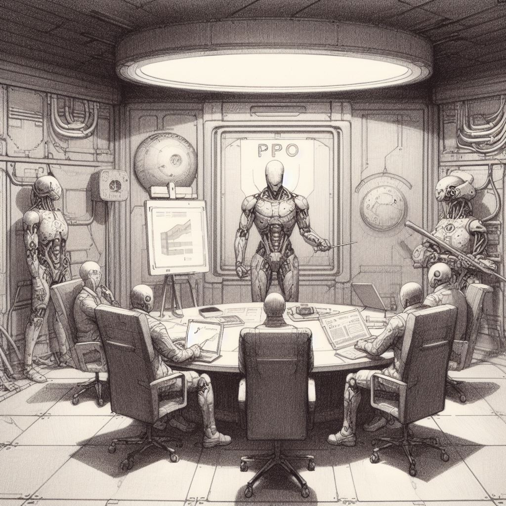
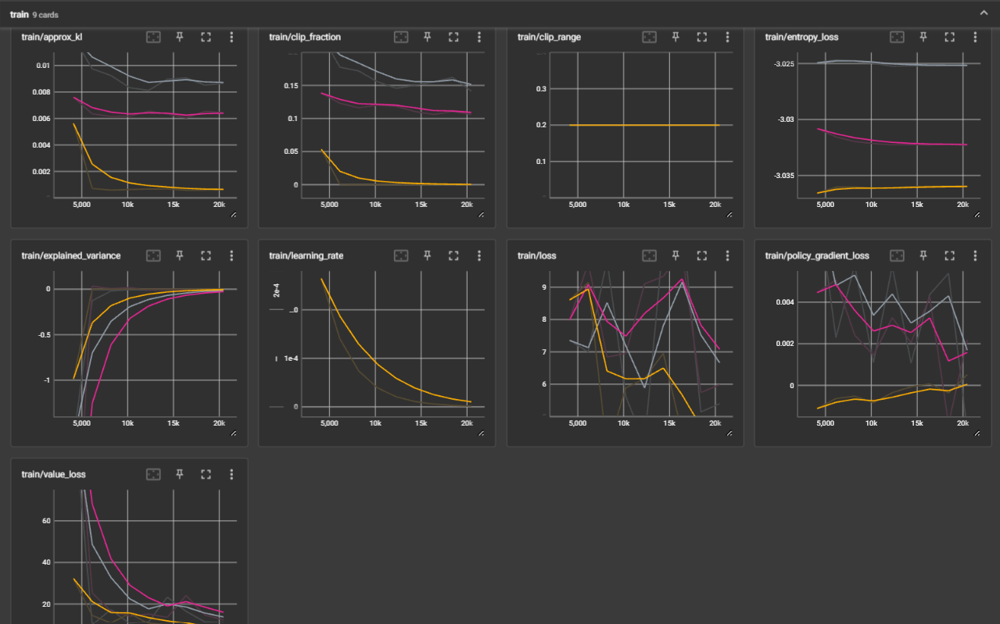

# Deep Reinforcement Learning for Stock Trading project



> Imágenes generadas por Dall-E 3

## Overview.

Welcome to the Deep Reinforcement Learning (DRL) for Stock Trading project! This repository contains an implementation of a custom Proximal Policy Optimization (PPO) algorithm applied to stock trading using the Gymnasium environment and stable_baselines3 library. The goal of this project is to empower an intelligent agent to learn optimal investment strategies and increase net worth by dynamically managing the allocation of assets.

All codes are thoroughly commented in Spanish. All the instructions provided in this README are explained in greater detail in the comments of the code.

## Table of contents
- [Prerequisites](#Prerequisites)
- [Features](#Features)
- [Usage](#Usage)
- [Tests](#Tests)
- [Possible next developments](#possible-next-developments)

## Prerequisites
Before running the code, make sure you have the required dependencies installed. You can install them using:
```
pip install matplotlib pandas numpy yfinance scikit-learn gymnasium stable-baselines3[extra] tqdm torch torchvision torchaudio
```

## Features
### Data Extraction (module ETL.py):
After obtaining historical financial data about our company (closing prices, opening prices, volume, etc.) using the Yahoo Finance API (yfinance), we calculate a series of technical indicators such as various simple and exponential moving averages or Fourier transforms of different components. The calculation methods can be seen in the methods of the classes in the ETL.py module.

All data is stored in the form of Pandas DataFrames and then separated into the train, validation and test set. These same sets are also returned scaled in the range [0,1] through the MinMaxScaler function of scikit-learn. However, in the algorithm I have not used this scaled data because it causes me to divide by 0, which is not admissible. It is a future task to see how we can fit the scaled data into the neural networks of the algorithm to improve its convergence while avoiding problems such as those mentioned in Environment

### Environment (modules Environment.py and EnvironmentCustomReward.py)
For the environment I have created two modules practically the same except for the reward function. While in Environment.py the reward function is very simple, based only on the difference in total equity (account balance plus value of shares held) of the current step and the previous step, in EnvironmentCustomReward.py a more complex reward is implemented including long term strategies or penalties.
In testing, I could see how the first one performs better for some reason (I imagine due to a poor design of the second one).

- Observation Space: The environment's observation space consists of two components:
history: A window of historical stock data, normalized between 0 and 1, represented as a 2D array.
other_info: A set of three scalar values representing the account balance, shares held, and net worth, all normalized between 0 and 1.

- Action Space: The agent can take discrete actions representing the percentage of its net worth to invest in the form of shares. The action space consists of 21 discrete values ranging from 0% to 100%.

- Transaction Cost: A transaction cost is applied to every action, representing a percentage of the transaction amount. This introduces a realistic aspect of trading fees.

- Reward Calculation: The agent's reward is calculated based on the change in net worth, encouraging the agent to maximize its total value over time.

Episodes end when after 365 steps (i.e. one year), no net return above a threshold (1 or 2% in tests) has been obtained.

### Agent (module Agent.py)
The provided code defines a StockTradingAgent class, implementing a Proximal Policy Optimization (PPO) algorithm for stock trading using the stable_baselines3 library. The agent is initialized with a custom PPO model, incorporating a specially designed policy and feature extraction mechanism. The learning rate of the model follows an exponential decay schedule, facilitating adaptive training. The agent can be trained over a specified number of timesteps, and the model is periodically saved during training. The class also supports model loading and evaluation, simulating the agent's performance over a given number of steps using a separate validation environment. The training progress is logged, and the trained model can be saved for future use. The agent's actions and episode information during evaluation are recorded for analysis.

The custom learning rate scheme I have programmed is specifically designed to trace an exponential decay curve given the desired initial and final values for the learning rate. In my opinion, being able to control the decay through these values makes the finetuning task more intuitive.

We see the mechanisms created for feature extraction and decision making in the next section.

### Feature Extractor and Deep Neural Network (CustomPPO_LSTM.py and CustomPPO_CNN.py)
The custom Proximal Policy Optimization (PPO) algorithm in this implementation is designed for stock trading using stable_baselines3. The feature extraction is orchestrated by a CustomCombinedExtractor class that I coded, which comprises two distinct nets for processing historical data and additional information. The history data undergoes an intricate Long Short-Term Memory (LSTM) transformation, capturing temporal dependencies, while the other information is processed through a Multi-Layer Perceptron (MLP). These feature extractors are combined, and the resulting features are fed into a CustomNetwork, a policy and value network. The policy network outputs probabilities of actions using a softmax activation, while the value network estimates the state value. Both networks are initialized with Xavier uniform weights. The entire architecture is encapsulated within the CustomActorCriticPolicy, extending the MultiInputActorCriticPolicy from stable_baselines3, and it utilizes the Adam optimizer with a learning rate schedule.

This architecture is tailored to capture intricate patterns in stock data, facilitating the learning process for the reinforcement agent. The combination of LSTM for historical data and an MLP for additional information enables the agent to make informed decisions in a dynamic trading environment, ultimately optimizing its investment strategy for increased net worth.

Regarding the Extractor, I first programmed one based on a 1D CNN network (in the CustomPPO_CNN module) to test how useful these networks can be in the study of this type of data. Unfortunately it has considerably worse results than the LSTM-based Extractor.

In the MLP networks both the Extractor and the decision making have elements such as Dropout layers to prevent overfitting. I also added Batch Normalization in the neural network to stabilize convergence, although it was impossible to add it in the Extractor as the stable_baselines3 PPO algorithm itself extracts features from observations with batches of 1 single example.

## Usage
The way to use the code provided in this repository is explained in the main.ipynb notebook with comments. Perhaps, to make the most of the utilities that the code offers, it may be convenient to take a look at the methods of the various classes provided in the modules.

## Tests
Las pruebas y los entrenamientos pueden monitorizarse en tensorboard. Algunos experimentos realizados por mí arrojaron resultados como los siguientes:



## Possible next developments
There exists significant potential for the expansion and enrichment of this project through the exploration of uncharted territories. One avenue for advancement involves the integration of alternative predictive models rooted in various architectures. Price predictions could be included in the dataset, enriching it and providing the DRL algorithm with more information for decision making. New indicators, perhaps non-technical, could also be added, such as risk or turbulence indices, market sentiment or social network analysis, etc. We can potentially capture more intricate patterns within the historical data, leading to more nuanced and accurate decision.

Another quite promising possible future implementation could be to allow the Agent to invest his wealth in shares of more than one company (perhaps related to each other) in order to diversify and make more flexible decisions.
